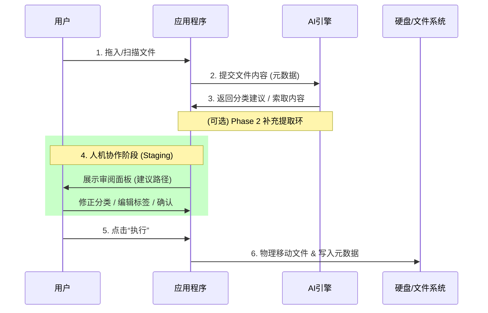

# AI本地知识库功能提升需求文档 (PRD) v3.0

## 1. 项目背景与目标
当前“AI本地知识库”主要通过 AI 对本地文件进行初步分类和摘要。为彻底解决“检索弱、分类乱、不敢用”的核心痛点，本次升级将系统重构为**“人机协作型智能文件管理中心”**。
**核心理念**：AI 仅作为“建议者 (Copilot)”，用户拥有最终的“决策权 (Captain)”。

---

## 2. 核心痛点与详细场景分析

| 痛点维度 | 用户真实心声与场景 | 深度解决方案 |
| :--- | :--- | :--- |
| **检索维度** | “我只记得那个文件是上个季度关于‘税务’的 PDF，搜文件名根本找不到，只能一个个文件夹翻。” | **复合条件检索引擎**：支持 `Time + Type + Tag + Semantic` 的组合查询。 |
| **文件管理** | “桌面堆满了临时下载的微信文件、截屏和发票，看着就烦，但也懒得整理，怕删错。” | **智能归档投喂区 (Drop Zone)**：一键拖入，自动识别、重命名、归位。 |
| **信任机制** | “上次用个整理软件，把我正在写的代码文件给移走了，搞得我编译报错，吓死我了。” | **安全确认沙箱**：所有移动操作仅在用户点击“执行”后发生，且提供“一键撤销”。 |
| **分类逻辑** | “AI 给我建了‘发票’、‘报销凭证’、‘财务’三个文件夹，其实我只想把它们都塞进‘财务’里。” | **受控分类体系**：强制 AI 遵循用户定义的目录树，允许设置分类数量期望。 |
| **分析效率** | “一次导入 200 个文件，AI 分析了 10 分钟还没完，这等待时间太痛苦了。” | **批量加速策略**：元数据先行打包分析 + 渐进式内容提取，显著缩短响应队列。 |
| **存储效率** | “同一个资料我在微信、邮件、网盘里存了好几份，电脑空间都快满了。” | **基于内容的去重 (Content-Addressable)**：利用 MD5/SHA256 识别真重复。 |

---

## 3. 功能需求详述 (Detailed Requirements)

### 3.1 深度复合适用检索引擎 (Advanced Search Engine)

#### 3.1.1 功能逻辑
*   **倒排索引构建**：系统需对所有已管理文件的以下字段建立索引：
    *   `filename` (文件名)
    *   `ai_summary` (AI 生成的 200 字摘要)
    *   `ai_tags` (AI 提取的 5-10 个关键标签)
    *   `ai_reasoning` (AI 分类理由)
    *   `file_content` (文本类文件的全文前 10KB)
*   **混合排序算法**：
    *   搜索结果按 `Relevance Score` (相关性分数) 降序排列。
    *   分数权重：`文件名匹配 (1.0)` > `摘要/标签匹配 (0.8)` > `语义全文匹配 (0.6)`。

#### 3.1.2 UI/交互设计
*   **搜索栏**：支持自然语言输入（如：“找一下去年的装修合同”）。
*   **高级筛选面板 (Filter Panel)**：
    *   **时间轴**：滑动选择文件创建/修改时间范围（如：近7天、本月、2024年）。
    *   **文件类型**：多选 Checkbox（文档、图片、代码、音频）。
    *   **分类目录**：树状多选，仅在特定文件夹内搜索。
*   **结果展示卡片**：
    *   每条结果展示：图标、文件名、**高亮关键词的摘要片段**、所属路径、匹配度标签。

### 3.2 智能分类控制中心 (Taxonomy Control Center)

#### 3.2.1 结构锁定模式 (Structure Locking)
用户可在设置中开启“**严格模式 (Strict Mode)**”：
*   **规则**：AI **绝对不允许**在根目录下并在二级目录下创建新文件夹。
*   **行为**：AI 必须计算文件与现有文件夹向量的相似度（Cosine Similarity），强制归入最相似的已有文件夹。
*   **Fallback**：如果所有现有文件夹的相似度都低于阈值（如 0.6），则归入顶层的 `_Unclassified` (未归类) 文件夹，等待人工处理。

#### 3.2.2 数量与深度限制
*   **Max Depth**：限制分类层级深度（**建议默认 3 级**，用户可配置 2-5 级）。
    *   *第 1 级（领域）*：Work / Life / Archive
    *   *第 2 级（实体/项目）*：Project Alpha / 房屋装修 / 财务报表
    *   *第 3 级（上下文/时间）*：Contracts / 2025 / Source Code
    *   *理由*：3 级结构能覆盖绝大多数管理需求，过深会导致点击疲劳和检索困难。
*   **Max Fan-out**：限制单层级下最大文件夹数量（如：每个目录下最多 10 个子目录），防止目录树过度膨胀。
*   **灵活模式数量反馈 (Target Count Control)**：在灵活模式下，允许用户输入“期望生成的分类数量”（例如 5-10 个）。AI 将根据此数值调整分类的聚合度，避免产生过多细碎的文件夹。

#### 3.2.3 黑白名单系统
*   **忽略列表 (.aiignore)**：
    *   支持 Glob 模式匹配（如 `**/*.log`, `**/node_modules/**`）。
    *   被忽略的文件不进行 AI 分析，仅作普通索引或完全不可见。

### 3.3 AI 自主决策内容提取 (AI-Driven Content Extraction)

采用“**AI 自主面试**”策略，替代传统的“硬编码提取”，根本上解决 Token 浪费与提取不准的矛盾。

#### 3.3.1 核心理念
*   **元数据先行**：AI 首先只阅读文件的“简历”（元数据），仅在必要时主动要求“面试”（提取内容）。
*   **按需索取**：AI 决定需要什么内容（前500字？表头？图片视觉？），系统再精准提供。

#### 3.3.2 执行流程 (The Protocol)
1.  **Phase 1: 快速预审 (Metadata Scan)**
    *   系统打包发送待处理文件的清单：`[{ name: "财报.pdf", size: "5MB" }, { name: "IMG_001.jpg", size: "3MB" }]`。
    *   AI 返回初步指令：
        *   **Direct (确定)**：`"财报.pdf" -> /Work/Finance`
        *   **Need_Info (存疑)**：`"IMG_001.jpg" -> 需调用 Vision 识别视觉主题`
2.  **Phase 2: 深度补全 (On-Demand Extraction)**
    *   系统解析 AI 的 `Need_Info` 指令。
    *   **针对性提取**：
        *   *文档类*：提取前 1KB 文本或目录结构。
        *   *表格类*：提取 Header 和前 5 行数据。
        *   *图片类*：调用 Vision API 或提取 EXIF/OCR 信息。
    *   系统将补充信息二次发送给 AI。
3.  **Phase 3: 最终决策 (Final Verdict)**
    *   AI 综合补充信息，输出最终分类和去重建议。

#### 3.3.3 优势
*   **极低成本**：80% 的文件仅靠文件名即可准确分类，无需消耗大量 Token 读取内容。
*   **精准分析**：AI 根据上下文主动索取关键信息（如“给我看这个代码的 Readme”），比死板的截断更有效。

### 3.4 人机协作确认工作流 (Review & Commit Workflow)

这是本产品的**核心差异化功能**，采用“Git Staging”的设计理念。
**核心时机**：该流程发生在 **AI 分析之后**，但在 **物理文件被移动之前**。



#### 3.4.1 预处理阶段 (Staging)
*   用户选择扫描目录或拖入文件。
*   系统进入“**AI 思考中 (Thinking...)**”状态。
*   **执行 3.3 章节定义的“元数据快审”流程**，快速生成初步建议。

#### 3.4.2 审阅面板 (The Review Dashboard)
界面分为左中右三栏布局：
*   **左侧：原始文件 (Source)**
    *   列表展示待处理文件。
    *   状态标记：`New`, `Processing` (AI 索取内容中), `Done`。
*   **中间：AI 建议 (AI Proposal)**
    *   展示**变换箭头**：`原始路径` ➔ `建议目标路径`。
    *   展示**AI 思考**：显示 AI 为什么这么分类。
*   **右侧：属性编辑 (Metadata Editor)**
    *   当前选中文件的详细信息。

#### 3.4.3 批量操作工具
*   **多选操作**：按住 Shift/Cmd 多选文件，右键菜单选择“批量移动到...”。
*   **一键修正**：支持直接拖拽到正确的分类树节点。

#### 3.4.4 提交执行 (Commit)
*   用户点击“**执行变更 (Execute Changes)**”。
*   系统按顺序执行文件移动/重命名操作，并记录回滚日志。

### 3.5 智能拖拽归档 (Drop-to-Archive)

#### 3.5.1 交互流程
1.  用户将桌面上的 50 个乱序文件选中，拖入软件主界面的“投喂区”。
2.  **查重拦截**：系统计算 MD5，发现其中 5 个文件已存在于知识库中。
    *   弹窗/浮层提示：“发现 5 个重复文件，是否跳过或覆盖？”
3.  **智能分拣**：
    *   剩余 45 个文件并行上传给 LLM 进行分析。
    *   系统尝试将它们匹配到当前的目录树结构中。
4.  **进入审阅面板**：流程同 3.4.2，用户确认后完成归档。

### 3.6 数据一致性与去重 (De-duplication & Integrity)


#### 3.5.1 硬查重 (Content Hashing)
*   **时机**：文件扫描/拖入通过时即刻计算（小文件流式计算，大文件抽样计算或异步计算）。
*   **标识**：在数据库中建立 `hash_index`。
*   **处理**：
    *   **完全重复**：提示用户，建议删除新文件或仅建立引用。
    *   **内容相同文件名不同**：提示“可能是同一文件的副本”，建议统一命名。

#### 3.5.2 软链接支持 (Symlinks) - *高级选项*
*   对于希望保留原位置但也想归档的文件，支持创建**软链接 (Symbolic Link)** 而非物理移动，节省磁盘空间。

---

## 4. 非功能性需求 (NFR)

### 4.1 性能指标
*   **响应速度**：本地搜索结果应在 200ms 内返回。
*   **并发处理**：支持同时分析 100+ 个文件，UI 不卡顿（需使用 Web Worker 或 Electron 主进程处理耗时任务）。
*   **Token 优化**：采用 **AI 自主决策提取** (见 3.3)，仅对必要文件进行深度读取，极大降低 Token 消耗。

### 4.2 安全与隐私
*   **API Key 安全**：用户的 API Key 必须加密存储（使用 `keytar` 或系统级 Keychain）。
*   **操作可逆**：并在执行移动操作前，自动生成 `undo_script.sh` 或记录回滚日志，确实支持“一键撤销”。

---

## 5. 数据结构设计 (Data Schema v3.0)

升级 `.metadata.json` 以支持上述复杂逻辑：

```typescript
interface KnowledgeBase {
  version: "3.0";
  config: {
    // 分类策略配置
    taxonomyMode: "strict" | "flexible"; // 严格模式 | 灵活模式
    maxDepth: number;     // 最大深度
    maxChildren: number;  // 单层最大子项
    targetCategoryCount?: number; // 灵活模式下建议的分类数量
    ignorePatterns: string[]; // 忽略名单
    accelerationMode: boolean; // 是否开启批量元数据加速分析
  };
  taxonomy: {
    // 固定的分类树结构
    root: CategoryNode[];
  };
  files: {
    [fileHash: string]: {
      id: string;
      originalName: string; // 原始文件名
      currentPath: string;  //当前存储路径
      size: number;
      mtime: number;        // 修改时间
      contentHash: string;  // MD5
      
      // AI 分析数据
      ai: {
        summary: string;
        tags: string[];
        reasoning: string;  // 分类理由
        confidence: number; // 置信度 0.0-1.0
        embedding?: number[]; // [规划中] 向量数据
      };
      
      // 用户行为记录
      userOverride: boolean; // 用户是否人工修正过
    }
  };
}
```

---

## 6. 实施路线图 (Implementation Plan)

### Phase 1: 核心重构 (当前重点)
*   [ ] 升级 `FileScanner` 模块，支持 MD5 哈希计算。
*   [ ] 实现 `TaxonomyManager`，支持加载/保存分类树结构。
*   [ ] 重构 UI，实现“左-中-右”三栏布局的**审阅面板**。

### Phase 2: 交互升级
*   [ ] 实现拖拽投喂 (Drop Zone) 交互。
*   [ ] 完善批量操作（多选、右键菜单）。

### Phase 3: 搜索与优化
*   [ ] 实现高级筛选器 UI。
*   [ ] 引入本地 Full-text Search 库 (如 FlexSearch)。
